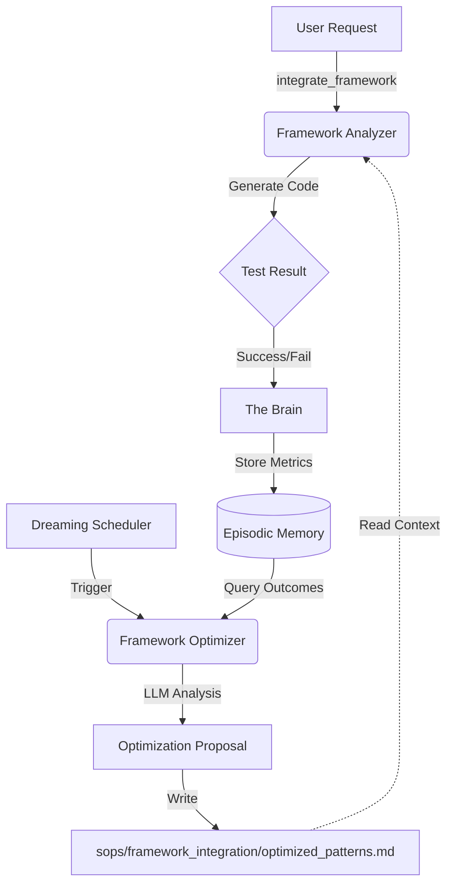

# Framework Self-Optimization Architecture

This document describes the recursive self-improvement capability of the Framework Integration Engine.

## Overview

The system implements a closed-loop feedback mechanism where:
1.  **Framework Analyzer** logs detailed metrics (success/fail, duration, LoC, tokens) of every integration attempt to **The Brain**.
2.  **Dreaming (Offline Simulation)** triggers periodic meta-analysis sessions.
3.  **Framework Optimizer** analyzes historical performance data to identify patterns and propose improvements.
4.  **SOP Updates**: Optimizations are written to `sops/framework_integration/optimized_patterns.md`, which informs future integration strategies.

## Architecture

### 1. Data Collection (`framework_analyzer`)
The `integrate_framework` tool in `src/mcp_servers/framework_analyzer/tools.ts` captures:
-   **Outcome**: Success or Failure.
-   **Metrics**: Duration (ms), Lines of Code (LoC), Token Usage.
-   **Context**: Framework Name, Source Type (CLI/SDK).

This data is stored in **The Brain** (Episodic Memory) with `type: "framework_integration_outcome"`.

### 2. Meta-Analysis (`framework_optimizer`)
A dedicated MCP server at `src/mcp_servers/framework_optimizer/` exposes `propose_integration_optimization`.
-   It queries The Brain for recent outcomes.
-   It uses an LLM to find correlations (e.g., "SDK integrations with poorly defined types fail 40% of the time").
-   It generates an **Optimization Proposal**.

### 3. Feedback Loop (`dreaming`)
The Dreaming server (`src/mcp_servers/dreaming/`) includes a tool `start_framework_optimization_session`.
-   This can be triggered manually or by the Scheduler.
-   It orchestrates the optimization process.

### 4. Applied Learning
The output is saved to `sops/framework_integration/optimized_patterns.md`.
Future versions of `framework_analyzer` can read this file to adjust their prompts or strategies (to be implemented in Phase 23).

## Data Flow

## Future Work
-   **Active SOP Injection**: Automatically inject `optimized_patterns.md` into `framework_analyzer` system prompts.
-   **Self-Healing**: Automatically retry failed integrations using suggested optimizations.
