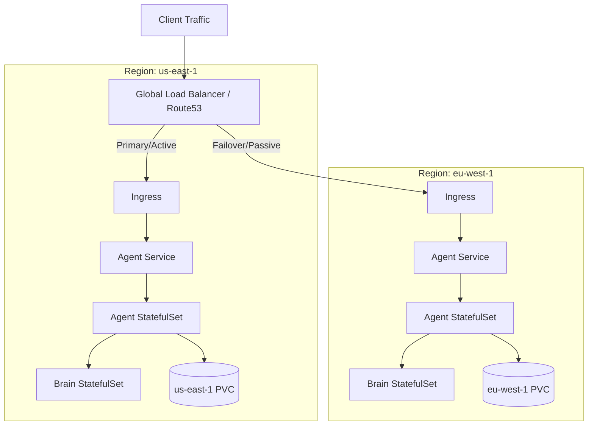

# Kubernetes Production Deployment

This guide details the production-grade Kubernetes deployment architecture for the Digital Agency (Simple-CLI).

## Architecture

The deployment is split into two primary StatefulSets to ensure persistence and scalability:

### 1. Agent StatefulSet (`deployment/chart/simple-cli/templates/deployment.yaml`)
The core orchestrator responsible for managing tasks, SOP execution, and HR loops.

*   **Containers:**
    *   `agent`: Runs the main `daemon.ts` process.
    *   `health-monitor`: Sidecar container running the Health Monitor MCP server.
*   **Volumes:**
    *   `.agent` (PVC): Stores logs, metrics, and local context. Shared between `agent` and `health-monitor`.
    *   `.agent/brain` (PVC): Mounts the Brain's storage for direct access (optional) or consistency.
*   **Networking:**
    *   Exposes port `3000` (Agent API) and `3004` (Health Monitor API).

### 2. Brain StatefulSet (`deployment/chart/simple-cli/templates/brain-deployment.yaml`)
The centralized memory system (LanceDB + Semantic Graph).

*   **Containers:**
    *   `brain`: Runs the Brain MCP server.
*   **Volumes:**
    *   `.agent/brain` (PVC): Persistent storage for Vector DB and Graph JSON.
*   **Networking:**
    *   Exposes port `3002` (Brain API/SSE).

## Multi-Region High Availability

The chart supports multi-region deployment with automated failover and geographic load balancing to ensure enterprise resilience.

### Architecture

When `multiRegion.enabled` is set to `true`, the deployment automatically scales to a multi-region topology within the cluster (or across a federated cluster).



### Configuration

Enable multi-region in your `values.yaml`:

```yaml
multiRegion:
  enabled: true
  regions: ["us-east-1", "eu-west-1"]
  failover:
    enabled: true
  loadBalancing:
    geo: false # Set to true for geographic routing, false for active-passive
```

*   **StatefulSets per Region:** The chart automatically iterates over the `regions` list and generates a dedicated `StatefulSet`, `Service`, and `PVC` per region, using `nodeAffinity` (`topology.kubernetes.io/region`) to schedule pods correctly.
*   **Global Service:** A global `LoadBalancer` service (`service-global.yaml`) and an `Ingress` (`ingress-multiregion.yaml`) are created. They utilize `external-dns` annotations to configure AWS Route53 (or compatible providers) for either geographic routing or active-passive failover between the regional endpoints.

## Multi-Tenancy

Multi-tenancy is achieved via Namespace isolation and the `company` parameter.
*   Each client/company gets its own Namespace (e.g., `client-a`).
*   Each Namespace has its own PVCs, ensuring data isolation.
*   The `company` environment variable injects the context ID.

## Validation & Testing

We include a comprehensive integration test suite to validate the K8s topology without requiring a running cluster.

### Running Validation Tests

The tests simulate the K8s environment by:
1.  Creating temporary directories to mimic PVCs.
2.  Spawning `Brain` and `HealthMonitor` processes on ports 3002/3004.
3.  Running Agent logic against these simulated services.

To run the validation suite:

```bash
npm run test tests/integration/k8s_production_validation.test.ts
```

### What is Validated?

1.  **Multi-Tenancy Isolation:** Verifies that data stored for `company-a` is not accessible by `company-b`.
2.  **Persistence:** Verifies that data survives a "Pod Restart" (process kill/start).
3.  **Sidecar Communication:** Verifies the Agent can log metrics to the shared volume and the Health Monitor sidecar can read/serve them.
4.  **4-Pillar Integration:** Validates SOP execution logging and HR Proposal creation flow in the distributed environment.

## Production Hardening

*   **Liveness/Readiness Probes:** Configured for all containers to ensure traffic is only sent to healthy pods.
*   **Resource Limits:** CPU/Memory requests and limits are defined in `values.yaml`.
*   **Persistence:** `ReadWriteMany` access mode is recommended for scaling, though `ReadWriteOnce` works for single replicas.
