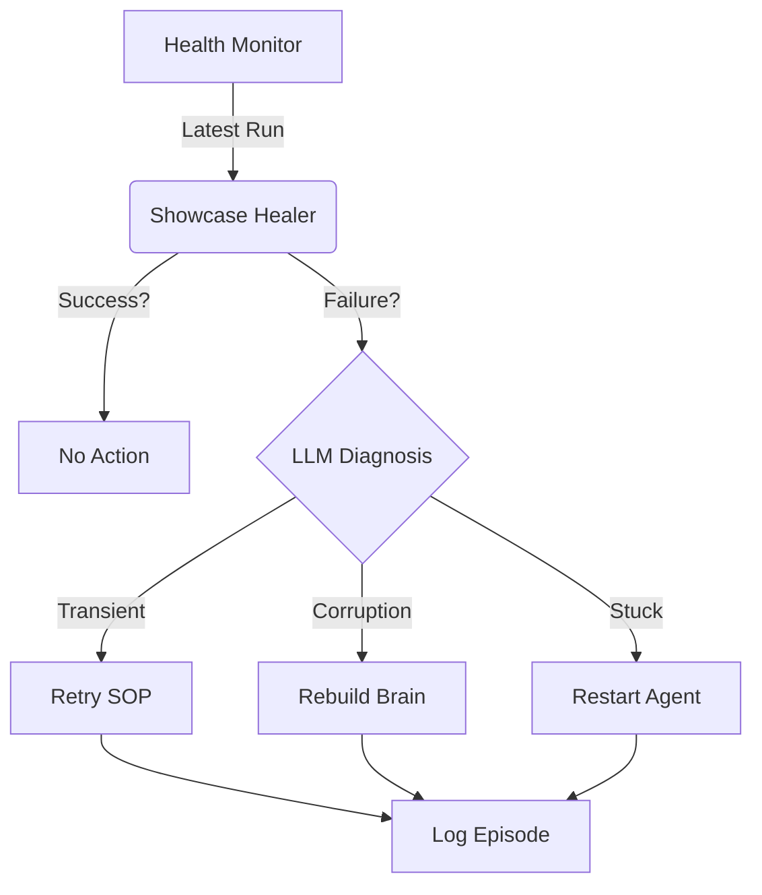

# Self-Healing Validation Loop

The **Showcase Healer** (`showcase_healer`) is a dedicated MCP server that autonomously monitors, analyzes, and repairs failures in the daily production showcase.

## Architecture

1.  **Monitor**: Fetches the latest showcase run results from the Health Monitor via the `get_latest_showcase_run` tool.
2.  **Analyze**: Uses an LLM to diagnose the root cause of failures (e.g., transient network issue vs. code bug).
3.  **Heal**: Executes targeted fixes:
    *   **Retry SOP**: Re-runs the SOP with adjusted parameters if the failure seems transient (via `sop_engine`).
    *   **Rebuild Brain**: Triggers a vector index rebuild if memory corruption is suspected.
    *   **Restart Agent**: Restarts the daemon if the agent is stuck.
4.  **Log**: Stores a "Healing Episode" in the Brain for auditability and future learning (`type: showcase_healing_episode`).

## Workflow

## Integration

The healer is registered as an MCP server and can be invoked manually or scheduled via CRON.

Tool: `heal_showcase`
Args: `{ "run_id": "optional-id" }`

## Implementation Details

-   **Location**: `src/mcp_servers/showcase_healer/`
-   **Dependencies**: `health_monitor`, `sop_engine`, `brain`
-   **Logic**: `healer.ts` contains the core analysis and decision loop.

## Future Improvements

-   **Code Fixes**: Allow the healer to propose and apply code patches via `roo_code` for persistent bugs.
-   **Predictive Healing**: Use anomaly detection to heal before failure occurs.
