# General Purpose Developer Agent ("Simple")

## Overview
The **General Purpose Developer Agent** is an autonomous assistant capable of performing software engineering tasks just like a junior-to-mid-level developer. It can fix bugs, implement features, refactor code, and write tests—all while communicating naturally in **Slack** or **GitHub Issues**.

This agent uses a combination of advanced LLM reasoning, file system access, and Git integration to create fully formed Pull Requests.

---

## Agent Capabilities

| Capability | Description |
| :--- | :--- |
| **Bug Fixing** | Reproduces user-reported bugs with test cases, fixes the root cause, and verifies the solution. |
| **Test-Driven Development (TDD)** | Writes tests before code, ensuring high coverage and regression prevention. |
| **Code Understanding** | Navigates large codebases to find relevant files and dependencies. |
| **Full PR Lifecycle** | Creates branches, commits changes, and pushes to remote repositories. |
| **Memory & Context** | Remembers project conventions (e.g., linting rules, naming patterns) via `.agent/memory.md`. |

---

## Workflow Diagram

```mermaid
sequenceDiagram
    participant Requester as 👤 Slack User / GitHub Issue
    participant Agent as 🤖 Developer Agent
    participant Codebase as 📂 File System
    participant TestRunner as 🧪 Test Suite
    participant Repo as 🐙 Git (Remote)

    Requester->>Agent: "Fix ZeroDivisionError in calculator.py"
    Agent->>Codebase: Read 'calculator.py' & 'tests/'
    Agent->>TestRunner: Run existing tests (Verify Error)
    TestRunner-->>Agent: ❌ Test Failed! (ZeroDivisionError)
    
    Agent->>Codebase: **Edit 'calculator.py'** (Add try-except)
    Agent->>TestRunner: Rerun tests
    TestRunner-->>Agent: ✅ Test Passed!
    
    Agent->>Repo: Create Branch 'fix-calc-bug'
    Agent->>Repo: Commit & Push Changes
    Agent->>Requester: "Fixed bug in branch 'fix-calc-bug'. PR ready."
```



---

## Example Scenario: Fixing a Critical Bug

**User Request (Slack)**: 
> "@Simple I'm getting a ZeroDivisionError in `calculator.py`. Fix the bug so it returns 'Error' instead of crashing. Run a test to verify."

### 1. Reproduction (TDD Approach)
The agent first creates a test case to reproduce the failure.

```python
# test_calculator.py
def test_divide_zero(self):
    # This will fail initially
    result = divide(10, 0)
    self.assertEqual(result, "Error")
```

### 2. Code Fix
The agent modifies the `divide` function to handle the edge case safely.

```python
# calculator.py (Before)
def divide(a, b):
    return a / b  # Causes Crash

# calculator.py (After Agent Fix)
def divide(a, b):
    if b == 0:
        return "Error"
    return a / b
```

### 3. Verification
The agent runs the test suite again.

```bash
$ python3 -m unittest test_calculator.py
.
----------------------------------------------------------------------
Ran 1 test in 0.001s

OK
```

### 4. Git Operations
Finally, the agent commits the change with a professional commit message:

```bash
git checkout -b fix-calculator-bug
git add .
git commit -m "fix(calculator): handle division by zero gracefully"
git push origin fix-calculator-bug
```

---

## Technical Stack

- **Model**: "Code" Skill (Reasoning + Tool Use)
- **Tools**:
  - `read_file` / `write_file` / `list_files`
  - `run_shell` (for running tests like `pytest`, `npm test`)
  - `git_commit` / `git_push`
- **Interface**: Slack Bolt App (Interactive)
