# Oil & Gas Analytics Agent ("Jules")

## Overview
The **Oil & Gas Analytics Agent** is a specialized AI persona designed to assist Petroleum Engineers, Data Scientists, and Production Managers. It acts as a **Senior Data Scientist** capable of autonomously analyzing production data, running complex Python simulations (e.g., Decline Curve Analysis), and generating actionable reports directly within collaboration platforms like **Microsoft Teams** or **Slack**.

Unlike standard chatbots, this agent has full access to a **Python runtime environment**, **File System**, and **Git**, allowing it to perform real engineering work.

---

## Agent Capabilities

| Capability | Description |
| :--- | :--- |
| **Python Analytics** | Uses `pandas`, `numpy`, `scipy` to process CSV/Excel data and perform calculations. |
| **Data Visualization** | Generates plots (e.g., production history, pressure vs. time) using `matplotlib` or `seaborn`. |
| **Domain Knowledge** | Understands concepts like *Decline Curve Analysis (DCA)*, *Water Cut*, *GOR*, and *Tubing Pressure*. |
| **Git Integration** | Automatically commits reports and code to the repository for version control. |
| **Self-Correction** | If a script fails, it reads the error, modifies the code, and re-runs it until successful. |

---

## Workflow Diagram

The following diagram illustrates how the agent processes a request from a user in Microsoft Teams:

```mermaid
sequenceDiagram
    participant User as 👤 Petroleum Engineer
    participant Teams as 💬 MS Teams/Slack
    participant Agent as 🤖 AI Agent (Jules)
    participant Python as 🐍 Python Runtime
    participant Git as 🐙 Git Repo

    User->>Teams: "Analyze 'production_history.csv' and plot comparison."
    Teams->>Agent: Send Prompt
    Agent->>Agent: Plan Task & Write Python Script
    Agent->>Python: Execute Script (pandas/matplotlib)
    Python-->>Agent: Return Output & Charts (PNG)
    Agent->>Git: Commit 'report.md' & 'chart.png'
    Agent->>Teams: "Analysis complete. See attached chart."
```



---

## Example Scenario: Production Optimization

**User Request**: 
> "Analyze 'data/production_history.csv'. Calculate the average daily oil production for each well. If any well is below 200 bbl/d, flag it as 'Low Production'. Generate a bar chart comparing the wells."

### 1. Data Processing
The agent reads the CSV file to understand the schema and data quality.

```python
import pandas as pd

# Agent automatically generates and runs this
df = pd.read_csv('data/production_history.csv')
avg_prod = df.groupby('well_id')['oil_production_bbl'].mean()
low_performers = avg_prod[avg_prod < 200]
print(low_performers)
```

### 2. Visualization Output
The agent generates a chart to visualize the data.


### 3. Report Generation
The agent creates a markdown summary:

> **Production Summary**:
> - **WELL-001**: 150.5 bbl/d (⚠️ **Low Production**) -> *Recommendation: Check choke size and tubing pressure.*
> - **WELL-002**: 300.0 bbl/d (✅ Healthy)

### 4. Continuous Learning (Memory)
If the user provides feedback (e.g., *"WELL-001 has a known sensor issue"*), the agent updates its memory file:

```markdown
# .agent/memory.md
- WELL-001 flow meter is unreliable; verified by field engineer.
- Prefer manual gauge data for WELL-001 if available.
```

---

## Technical Stack

- **Model**: Custom "Oil & Gas" Skill Prompt
- **Tools**:
  - `read_file` / `write_file` (FileSystem MCP)
  - `run_shell` (for Python execution)
  - `git_commit` (Git MCP)
- **Interface**: Microsoft Teams Bot Framework / Slack Bolt App
