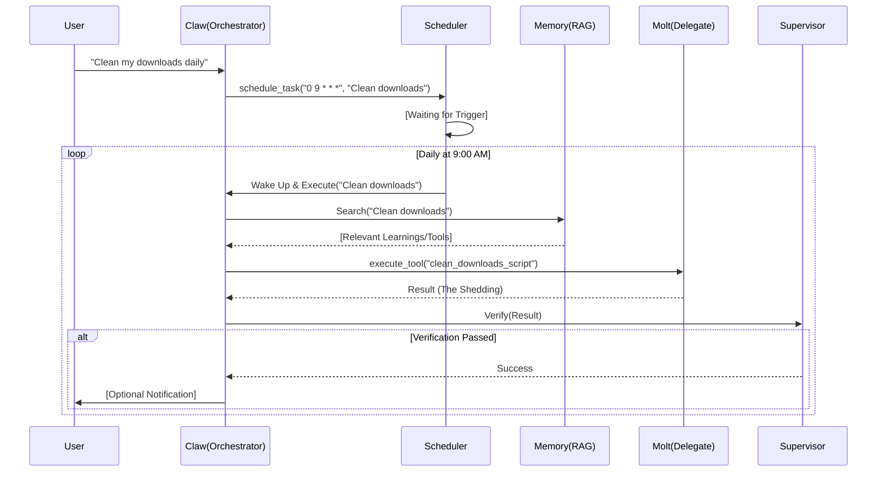

# Technical Specification for Simple-CLI (Meta-Orchestrator)

## 1. System Overview

**Simple-CLI** is a terminal-based AI agent designed as a **Meta-Orchestrator**. It acts as the central hub for executing tasks by delegating specialized work to domain-specific sub-agents (Codex, Gemini, Claude, etc.) or utilizing local tools via the Model Context Protocol (MCP).

This specification serves as the primary source of truth for the implementation, adhering to **Specification-Driven Development (SDD)** principles.

---

## 2. Philosophy: The Claw & The Molt

The architecture is driven by a duality of persistence and impermanence.

### 2.1 Claw (The Constant)
The **Claw** is the backbone of the system. It represents **Persistence**.
*   **Role**: To "claw" onto state, identity, and knowledge across time.
*   **Behavior**: It runs as the main Meta-Orchestrator engine. It manages the long-term memory (`learnings.json`), the schedule (Cron), and the tool registry.
*   **Characteristics**: Efficient, low-latency, stateful. It does not "die" between tasks.

### 2.2 Molt (The Variant)
The **Molt** is the arm of the system. It represents **Evolution**.
*   **Role**: To execute high-intensity, specialized tasks and then "shed" (molt) its skin.
*   **Behavior**: Spun up Just-In-Time (JIT) via `delegate_cli`. It receives a specific context, creates necessary temporary tools, executes the work, and then terminates.
*   **Characteristics**: Ephemeral, resource-intensive, disposable.
*   **The Shedding**: When a Molt dies, it MUST transfer its valuable output (artifacts, new tools, learnings) back to the Claw. The "skin" (temp files, process memory) is discarded to keep the system clean.

---

## 3. Architecture

### 3.1 Core Components

1.  **Orchestrator Engine (`Engine`)**: The main event loop that processes user input, maintains context, and decides which tool or agent to invoke.
2.  **Supervisor Layer**: A validation loop that reviews the output of tools and delegated agents against the user's original request.
    *   **Role**: Quality Assurance (QA).
    *   **Action**: Approve (continue) or Reject (retry with feedback).
3.  **Tool Registry**: Manages internal tools (FileSystem, Git) and dynamic MCP tools.
4.  **Delegate Router**: Handles the spawning and communication with external CLI agents.
5.  **Learning Manager**: A specialized component for persisting successful strategies and recalling them in future contexts.
6.  **Scheduler (New)**: A cron-like subsystem for managing autonomous, recurring tasks.

### 3.2 Data Flow



---

## 4. Configuration Schema

The system is configured via `mcp.json` or `.agent/config.json`.

### 4.1 `mcp.json` Structure

```json
{
  "mcpServers": {
    "filesystem": {
      "command": "npx",
      "args": ["-y", "@modelcontextprotocol/server-filesystem", "."]
    }
  },
  "agents": {
    "codex": {
      "command": "gh",
      "args": ["copilot", "suggest"],
      "description": "GitHub Copilot CLI for snippet generation.",
      "supports_stdin": false
    },
    "gemini": {
      "command": "gemini",
      "args": [],
      "description": "Google Gemini CLI for research and reasoning.",
      "supports_stdin": true
    }
  },
  "scheduler": {
    "enabled": true,
    "tasks": [
      {
        "id": "cleanup-downloads",
        "cron": "0 9 * * *",
        "command": "clean_downloads",
        "description": "Organize Downloads folder by file type"
      }
    ]
  },
  "yoloMode": false,
  "autoDecisionTimeout": 0
}
```

---

## 5. Protocols & Interfaces

### 5.1 Delegation Protocol (`delegate_cli`)

The communication between the Orchestrator and Sub-Agents relies on standard I/O streams.

**Input (Invocation):**
The Orchestrator spawns the agent process with the task as the final argument.
```bash
<agent-command> [args...] "<task-description>"
```

**Context Injection (Critical):**
Agents operate in fresh processes. The Orchestrator MUST inject context using one of two strategies defined in the agent's config:
1.  **STDIN Piping**: For agents that read stdin (e.g., `gemini`).
    ```bash
    cat context.txt | agent "Refactor this"
    ```
2.  **File Arguments**: For agents that accept file paths (e.g., `codex`).
    ```bash
    agent "Refactor this" --file src/main.ts
    ```

**Output (Structured - Future):**
If the agent supports structured output, it should output a JSON object on the last line of `stdout`:
```json
{
  "status": "success", 
  "summary": "Updated 3 files.", 
  "artifacts": ["path/to/file.ts"] 
}
```

### 5.2 Tool Definitions

#### `delegate_cli`
*   **Description**: Delegate a complex task to a specialized external CLI agent.
*   **Parameters**:
    *   `cli` (string): The identifier of the agent (e.g., "codex", "gemini").
    *   `task` (string): The natural language instruction for the agent.
    *   `context_files` (array<string>, optional): List of files to prioritize in the sub-agent's context.

#### `schedule_task` (New)
*   **Description**: Register a recurring task to be executed by the agent autonomously.
*   **Parameters**:
    *   `cron` (string): Standard cron expression (e.g., "0 9 * * *").
    *   `prompt` (string): The instruction to execute (e.g., "Archive old log files").
    *   `description` (string): Human-readable description.
*   **Side Effect**: Updates `mcp.json` or `.agent/scheduler.json`.

#### Supervisor Verification
*   **Role**: Internal Agent Loop.
*   **Input**: `User Request`, `Tool Output`, `Side Effects` (e.g., file changes).
*   **Logic**:
    1.  Did the tool execute without error?
    2.  Does the output semantically answer the request?
    3.  If files were created, do they exist and contain valid code?
*   **Output**: Boolean (Pass/Fail) + Feedback String.

---

## 6. Memory & Self-Evolution

### 6.1 Learning Memory (RAG)
The system employs a simple RAG (Retrieval-Augmented Generation) mechanism to "learn" from its experiences.

*   **Storage Location**: `.agent/learnings.json`
*   **Structure**:
    ```typescript
    interface Learning {
        id: string;
        task: string;      // The original user request
        reflection: string; // "To fix X, I had to use tool Y with args Z..."
        timestamp: number;
    }
    ```
*   **Write Trigger**: When the Supervisor **PASSES** a task, it triggers a "Reflection" step. The LLM summarizes *why* the attempt was successful. This summary is committed to `learnings.json`.
*   **Read Trigger**: At the start of every turn, the engine searches `learnings.json` for keywords matching the current request. Relevant reflections are injected into the context window under `## Past Learnings`.

### 6.2 The "Reflective" Loop
Learning is more than just data storage; it requires active contemplation.

*   **Behavior**:
    1.  After a significant task (e.g., > 3 steps), the agent enters a "Reflection Mode".
    2.  It asks itself: *"What pattern did I use here that is generalizable?"*
    3.  It distills the specific (files, variable names) into the abstract (concepts, strategies).
    4.  **Example**: Instead of "I fixed `auth.ts` by adding a try-catch", it stores "General Strategy: Wrap external API calls in try-catch blocks to prevent crashes."

### 6.3 Dynamic Tool Creation
The agent has the ability to extend its own capabilities by creating new tools on the fly.

*   **Tool**: `create_tool`
*   **Mechanism**:
    1.  User asks for functionality X (e.g., "calculate md5 hash").
    2.  Agent writes a script (TypeScript/Python) to `source_path`.
    3.  Agent calls `create_tool(source_path, name="md5", ...)`.
    4.  **Persistence**: The tool is copied to `.agent/tools/md5.ts`.
    5.  **Hot Reload**: The `Registry` detects the new file and dynamically imports it. The `md5` tool becomes immediately available in the next prompt cycle.
*   **Usage**: The agent effectively remembers this tool exists because `Registry.loadProjectTools` scans default directories on every initialization.

---

## 7. Autonomous Scheduling & Maintenance

### 7.1 The "Thinking" Schedule
The agent is not just reactive; it can proactively manage its environment through the Scheduler.

*   **Goal**: Enable "Set and Forget" autonomy.
*   **Workflow**:
    1.  **User Request**: "Organize my desktop every Friday."
    2.  **Tool Creation**: Agent realizes it needs a script. Calls `create_tool` to generate `organize_desktop.ts`.
    3.  **Scheduling**: Agent calls `schedule_task` with cron `"0 17 * * 5"` and prompt `"Run organize_desktop tool"`.
    4.  **Execution**: On Friday at 5 PM, the system wakes up (if running as a daemon) or checks pending tasks on next boot, and executes the prompt.

### 7.2 Self-Maintenance (Relevance Checks)
To prevent "zombie tasks" (tasks that are no longer useful), the Scheduler includes a built-in "Relevance Audit".

*   **Mechanism**:
    *   Every task has a `last_useful_date` metadata.
    *   **The "Audit" Task**: Simple-CLI automatically schedules a weekly "Self-Audit" (e.g., Sunday at midnight).
    *   **Logic**:
        1.  The agent reviews the list of active tasks.
        2.  For each task, it asks itself: *"Is this task still providing value based on recent user activity and system state?"*
        3.  **Heuristic**: If a task fails or produces "No content changed" 3 times in a row, the Audit process will flagged it.
        4.  **Action**: The agent pauses the task and notifies the user: *"Task 'Cleanup Downloads' has been idle for 3 weeks. Should I delete it?"*

---

## 8. Path to AGI: The "Recursive Self-Improvement" Protocol

To move towards AGI-like behavior, the system must not just *learn* but *rewrite itself*.

### 8.1 The "Core Update" Mechanism
*   **Concept**: The agent should be able to read its own source code (`src/engine.ts`, `src/builtins.ts`) and propose architectural improvements.
*   **Safety**: Updates to the Core Logic require a **Dual-Verification** (Supervisor + Human Approval).
*   **Goal**: If the agent realizes its `learnings.json` lookup is inefficient, it can write a new vector-based adapter and hot-swap it.

### 8.2 "Dreaming" (Offline Simulation)
*   **Concept**: When idle (no user tasks), the Claw enters a simulation state.
*   **Activity**:
    1.  Replays past failures from `logs/`.
    2.  Spins up Molts to retry those failures with new strategies.
    3.  If a new strategy works, it updates `learnings.json`.
*   **Benefit**: The agent improves while the user sleeps.

---

## 9. Specification-Driven Development (SDD) Guidelines

To ensure high reliability, the system strictly follows SDD.

### 9.1 The "Spec First" Rule
Before ANY complex code generation, the agent MUST:
1.  **Read the Spec**: Consult this document or project-specific specs in `docs/`.
2.  **Generate a Plan**: Create a `implementation_plan.md` if the task is >1 file.
3.  **Define Tests**: Write a test case that fails *before* writing the implementation.

### 9.2 Test-Driven Execution (TDD)
1.  **Scaffold**: Create the interface/types.
2.  **Test**: Write a strict unit test asserting behavior.
3.  **Implement**: Write the code to pass the test.
4.  **Verify**: Run the test.

> **Constraint**: No code is "done" until a test proves it works. "It looks correct" is not a valid verification.

---

## 10. Error Handling & Resilience

### 10.1 Sub-process Management
*   **Timeouts**: Each delegated task has a default timeout (e.g., 5 minutes). If exceeded, the process is sent `SIGTERM`.
*   **Zombies**: On Orchestrator exit, all child processes (agents, MCP servers) MUST be killed.
*   **Stderr Capture**: `stderr` is buffered. If the process exits with non-zero code, `stderr` is presented as the error message to the Supervisor for analysis.

### 10.2 Hallucination Checks
*   **File Existence**: If an agent claims to have created `foo.ts`, the Supervisor MUST explicitly check `fs.existsSync('foo.ts')`.
*   **Syntax Check**: If code was written, run a linter/parser (e.g., `tsc --noEmit`) to verify validity before accepting.

---

## 11. Security & Autonomy Configurations

### 11.1 Permission Modes
To balance safety with autonomy, the system supports configurable permission levels in `mcp.json`.

*   **`yoloMode`** (Boolean, Default: `false`)
    *   **Description**: "You Only Look Once". Grants the agent full autonomy to execute commands (including file deletion, network requests, and code execution) without explicit user approval.
    *   **Use Case**: CI/CD pipelines, fully autonomous maintenance tasks, or power users who trust the agent implicitly.
    *   **Risk**: High. The agent can potentially destroy data.

*   **`autoDecisionTimeout`** (Number, Default: `0`)
    *   **Description**: The number of milliseconds the agent waits for user input before making an autonomous decision.
    *   **Logic**:
        1.  Agent proposes an action (e.g., "I need to install `lodash`").
        2.  It prompts the user: "Allow? (y/n) [Auto-accept in 60s]".
        3.  If `autoDecisionTimeout` > 0 and no input is received within the window, the agent defaults to **ACCEPT**.
    *   **Use Case**: Preventing the bot from getting stuck during long running tasks or overnight operations.
    *   **Safety**: Only applies to "Standard" risk actions. "Critical" actions (like `rm -rf /`) should still block indefinitely unless `yoloMode` is true.

### 11.2 Secret Management
*   **Secrets**: Secrets are passed via environment variables, never command-line arguments.
*   **Sandboxing**: (Future) Delegated agents should run in a containerized environment (Docker) to prevent system-wide damage.

---

## 12. Development Roadmap

1.  **Phase 1 (Current)**: Basics. `delegate_cli` works with `stdout`. MCP servers supported. Simple `learnings.json` RAG.
2.  **Phase 2**: Structured Communication. Implement JSON schema for agent-to-agent talk.
3.  **Phase 3**: Shared Memory & **Dreaming**. Agents share a vector database and perform offline simulations.
4.  **Phase 4**: Autonomous Scheduler. Implementation of the cron-based task runner and daemon mode.
5.  **Phase 5**: Recursive Self-Improvement. Agent gains safe write-access to its own `src/` directory.
