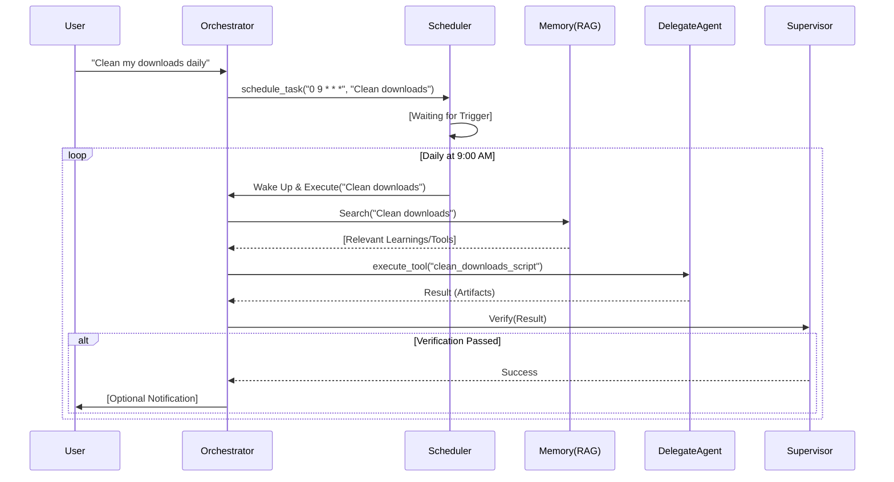

# Technical Specification for Simple-CLI (Meta-Orchestrator)

## 1. System Overview

**Simple-CLI** is a terminal-based AI agent designed as a **Meta-Orchestrator**. It acts as the central hub for executing tasks by delegating specialized work to domain-specific sub-agents (Codex, Gemini, Claude, etc.) or utilizing local tools via the Model Context Protocol (MCP).

This specification serves as the primary source of truth for the implementation, adhering to **Specification-Driven Development (SDD)** principles.

---

## 2. Architecture

### 2.1 Core Components

1.  **Orchestrator Engine**: The main event loop that processes user input, maintains context, and decides which tool or agent to invoke. This is the persistent, stateful core of the system.
2.  **Supervisor Layer**: A validation loop that reviews the output of tools and delegated agents against the user's original request.
    *   **Role**: Quality Assurance (QA).
    *   **Action**: Approve (continue) or Reject (retry with feedback).
3.  **Tool Registry**: Manages internal tools (FileSystem, Git) and dynamic MCP tools.
4.  **Delegate Router**: Handles the spawning and communication with external CLI agents (e.g., Claude, Aider) and local agents (Dify Supervisor/Coding).
5.  **Learning Manager**: A specialized component for persisting successful strategies and recalling them in future contexts.
6.  **Scheduler**: A cron-like subsystem for managing autonomous, recurring tasks.

### 2.2 Data Flow



---

## 3. Configuration Schema

The system is configured via `mcp.json` or `.agent/config.json`.

### 3.1 `mcp.json` Structure

```json
{
  "mcpServers": {
    "filesystem": {
      "command": "npx",
      "args": ["-y", "@modelcontextprotocol/server-filesystem", "."]
    }
  },
  "agents": {
    "codex": {
      "command": "gh",
      "args": ["copilot", "suggest"],
      "description": "GitHub Copilot CLI for snippet generation.",
      "supports_stdin": false
    },
    "gemini": {
      "command": "gemini",
      "args": [],
      "description": "Google Gemini CLI for research and reasoning.",
      "supports_stdin": true
    }
  },
  "scheduler": {
    "enabled": true,
    "tasks": [
      {
        "id": "cleanup-downloads",
        "cron": "0 9 * * *",
        "command": "clean_downloads",
        "description": "Organize Downloads folder by file type"
      }
    ]
  },
  "yoloMode": false,
  "autoDecisionTimeout": 0
}
```

---

## 4. Protocols & Interfaces

### 4.1 Delegation Protocol (`delegate_cli`)

The communication between the Orchestrator and Sub-Agents relies on standard I/O streams.

**Input (Invocation):**
The Orchestrator spawns the agent process with the task as the final argument.
```bash
<agent-command> [args...] "<task-description>"
```

**Context Injection (Critical):**
Agents operate in fresh processes. The Orchestrator MUST inject context using one of two strategies defined in the agent's config:
1.  **STDIN Piping**: For agents that read stdin (e.g., `gemini`).
    ```bash
    cat context.txt | agent "Refactor this"
    ```
2.  **File Arguments**: For agents that accept file paths (e.g., `codex`).
    ```bash
    agent "Refactor this" --file src/main.ts
    ```

**Output (Structured - Future):**
If the agent supports structured output, it should output a JSON object on the last line of `stdout`:
```json
{
  "status": "success", 
  "summary": "Updated 3 files.", 
  "artifacts": ["path/to/file.ts"] 
}
```

### 4.2 Tool Definitions

#### `delegate_cli`
*   **Description**: Delegate a complex task to a specialized external CLI agent.
*   **Parameters**:
    *   `cli` (string): The identifier of the agent (e.g., "codex", "gemini").
    *   `task` (string): The natural language instruction for the agent.
    *   `context_files` (array<string>, optional): List of files to prioritize in the sub-agent's context.

#### `schedule_task`
*   **Description**: Register a recurring task to be executed by the agent autonomously.
*   **Parameters**:
    *   `cron` (string): Standard cron expression (e.g., "0 9 * * *").
    *   `prompt` (string): The instruction to execute (e.g., "Archive old log files").
    *   `description` (string): Human-readable description.
*   **Side Effect**: Updates `mcp.json` or `.agent/scheduler.json`.

#### Supervisor Verification
*   **Role**: Internal Agent Loop.
*   **Input**: `User Request`, `Tool Output`, `Side Effects` (e.g., file changes).
*   **Logic**:
    1.  Did the tool execute without error?
    2.  Does the output semantically answer the request?
    3.  If files were created, do they exist and contain valid code?
*   **Output**: Boolean (Pass/Fail) + Feedback String.

---

## 5. The Brain: Hybrid Memory Architecture
To enable "long-term cognition," we reject simple text files in favor of a robust **Hybrid Memory System** stored in `.agent/brain/`.

### 5.1 Memory Types
1.  **Episodic Memory (Vector DB)**:
    *   **What**: "I remember fixing a similar bug in `auth.ts` last week."
    *   **Tech**: Local Vector Store (LanceDB or ChromaDB) running in-process.
    *   **Storage**: Embeddings of User Requests + Final Code Diffs + Reasoning Chains.
2.  **Semantic Memory (Knowledge Graph)**:
    *   **What**: "The user prefers functional programming. `auth.ts` depends on `user.ts`."
    *   **Tech**: JSON-based Graph or SQLite key-value store.
    *   **Schema**: Entities (User, File, Concept) and Edges (PREFERS, IMPORTS, SOLVES).
3.  **Procedural Memory (SOPs)**:
    *   **What**: "To deploy to AWS, I execute these 5 steps."
    *   **Tech**: `sops/` directory containing standard markdown checklists which the agent can read and execute.

### 5.2 The "Recall" Protocol
**Status**: ✅ Implemented and hardened with artifact linking.

Before acting, the Agent MUST query The Brain:
1.  **Mechanism**: The `ContextManager` acts as the interface between the Orchestrator and the Brain.
2.  **Search**: When loading context (`loadContext`), the system calls the `brain_query` MCP tool with the current task description.
3.  **Synthesis**: The Brain returns relevant past episodes (vector similarity search).
4.  **Context Injection**: These memories are appended to the *runtime* `ContextData` (returned by `loadContext`) under the `relevant_past_experiences` key and injected into the agent's prompt.
    > "You have solved a similar problem before. In task #102, you used `fs.writeFileSync`. User prefers `fs.promises`."

### 5.3 Learning (The Append Cycle)
Memory is immutable but additive.
*   **Trigger**: Successful Task Completion.
*   **Action**: The "Cortex" (background thread) digests the interaction:
    1.  Summarize the User Intent + Solution.
    2.  Embed the summary -> Vector DB.
    3.  Extract facts ("User hates semicolons") -> Update Knowledge Graph.
    4.  Update `learnings.md` for human-readable audit.

### 5.2 The "Reflective" Loop
Learning is more than just data storage; it requires active contemplation.

*   **Behavior**:
    1.  After a significant task (e.g., > 3 steps), the agent enters a "Reflection Mode".
    2.  It asks itself: *"What pattern did I use here that is generalizable?"*
    3.  It distills the specific (files, variable names) into the abstract (concepts, strategies).
    4.  **Example**: Instead of "I fixed `auth.ts` by adding a try-catch", it stores "General Strategy: Wrap external API calls in try-catch blocks to prevent crashes."

### 5.3 Dynamic Tool Creation
The agent has the ability to extend its own capabilities by creating new tools on the fly.

*   **Tool**: `create_tool`
*   **Mechanism**:
    1.  User asks for functionality X (e.g., "calculate md5 hash").
    2.  Agent writes a script (TypeScript/Python) to `source_path`.
    3.  Agent calls `create_tool(source_path, name="md5", ...)`.
    4.  **Persistence**: The tool is copied to `.agent/tools/md5.ts`.
    5.  **Hot Reload**: The `Registry` detects the new file and dynamically imports it. The `md5` tool becomes immediately available in the next prompt cycle.
*   **Usage**: The agent effectively remembers this tool exists because `Registry.loadProjectTools` scans default directories on every initialization.

### 5.4 Tool Discovery & Reusability
To maintain a lean and efficient system, the agent adheres to a "Discovery First" protocol.

*   **Search Protocol**: Before calling `create_tool`, the agent MUST search the existing **Tool Registry** and **RAG Memory** for similar functionality.
*   **Modular-First Principle**: When creating tools, the agent is encouraged to build **generic, parametrizable scripts** rather than hardcoded, task-specific ones.
    *   *Bad tool*: `clean_my_desktop_today.ts`
    *   *Good tool*: `folder_organizer.ts` with args for target directory and file-type rules.
*   **Indexing**: Every new tool MUST include a human-readable `description` and `usage` example. This metadata is indexed by the Orchestrator to ensure it can be retrieved by future Delegates.

---

## 6. Autonomous Scheduling & Maintenance

### 6.1 The "Thinking" Schedule
The agent is not just reactive; it can proactively manage its environment through the Scheduler.

*   **Goal**: Enable "Set and Forget" autonomy.
*   **Workflow**:
    1.  **User Request**: "Organize my desktop every Friday."
    2.  **Tool Creation**: Agent realizes it needs a script. Calls `create_tool` to generate `organize_desktop.ts`.
    3.  **Scheduling**: Agent calls `schedule_task` with cron `"0 17 * * 5"` and prompt `"Run organize_desktop tool"`.
    4.  **Execution**: On Friday at 5 PM, the system wakes up (if running as a daemon) or checks pending tasks on next boot, and executes the prompt.

### 6.2 Self-Maintenance (Relevance Checks)
To prevent "zombie tasks" (tasks that are no longer useful), the Scheduler includes a built-in "Relevance Audit".

*   **Mechanism**:
    *   Every task has a `last_useful_date` metadata.
    *   **The "Audit" Task**: Simple-CLI automatically schedules a weekly "Self-Audit" (e.g., Sunday at midnight).
    *   **Logic**:
        1.  The agent reviews the list of active tasks.
        2.  For each task, it asks itself: *"Is this task still providing value based on recent user activity and system state?"*
        3.  **Heuristic**: If a task fails or produces "No content changed" 3 times in a row, the Audit process will flagged it.
        4.  **Action**: The agent pauses the task and notifies the user: *"Task 'Cleanup Downloads' has been idle for 3 weeks. Should I delete it?"*

---

## 7. Path to AGI: The "Recursive Self-Improvement" Protocol

To move towards AGI-like behavior, the system must not just *learn* but *rewrite itself*.

### 7.1 The "Core Update" Mechanism
*   **Concept**: The agent should be able to read its own source code (`src/engine.ts`, `src/builtins.ts`) and propose architectural improvements.
*   **Safety**: Updates to the Core Logic require a **Dual-Verification** (Supervisor + Human Approval).
*   **Goal**: If the agent realizes its `learnings.json` lookup is inefficient, it can write a new vector-based adapter and hot-swap it.

### 7.2 "Dreaming" (Offline Simulation) & Elastic Swarms
*   **Concept**: When idle (no user tasks), the Orchestrator enters a simulation state to resolve past failures.
*   **Mechanism**:
    1.  **Trigger**: Scheduled cron task (default: 2 AM) invokes `dreaming` MCP server.
    2.  **Recall**: Queries the Brain's episodic memory for recent episodes marked with `Outcome: failure`.
    3.  **Simulation**: For each failure, spawns a specialized sub-agent (via Swarm protocol) to retry the task with a prompt emphasizing "new strategy".
    4.  **Resolution**:
        - If successful: The old failure episode is removed/archived, and a new episode is stored with the solution, tagged `resolved_via_dreaming: true`.
        - If failed again: The attempt is logged in the `simulation_attempts` field of the episode for future reference.
*   **Benefit**: The agent autonomously improves its success rate by leveraging downtime to solve previously insurmountable problems ("learning while sleeping").

### 7.3 Elastic Swarms (Self-Replicating Scale)
*   **Concept**: The agent system autonomously scales its computational capacity based on real-time demand, mimicking biological swarms.
*   **Mechanism**:
    1.  **Monitoring**: The `elastic_swarm` daemon (MCP server) monitors the `JobDelegator` queue length and active agent metrics.
    2.  **Scaling Up**: If `pending_tasks > 5`, the system spawns new sub-agents (via `swarm.spawn_subagent`) to parallelize execution.
    3.  **Scaling Down**: Agents that remain idle for >300s are automatically terminated (via `swarm.terminate_agent`) to conserve resources.
    4.  **Infrastructure Scaling**: Integrated with Kubernetes HPA to scale the underlying pods based on queue length custom metrics.
*   **Benefit**: Enables the "Business OS" to handle burst workloads (e.g., end-of-month reporting, viral marketing campaigns) without human intervention.

---

## 8. Specification-Driven Development (SDD) Guidelines

To ensure high reliability, the system strictly follows SDD.

### 8.1 The "Spec First" Rule
Before ANY complex code generation, the agent MUST:
1.  **Read the Spec**: Consult this document or project-specific specs in `docs/`.
2.  **Generate a Plan**: Create a `implementation_plan.md` if the task is >1 file.
3.  **Define Tests**: Write a test case that fails *before* writing the implementation.

### 8.2 Test-Driven Execution (TDD)
1.  **Scaffold**: Create the interface/types.
2.  **Test**: Write a strict unit test asserting behavior.
3.  **Implement**: Write the code to pass the test.
4.  **Verify**: Run the test.

> **Constraint**: No code is "done" until a test proves it works. "It looks correct" is not a valid verification.

---

## 9. Error Handling & Resilience

### 9.1 Sub-process Management
*   **Timeouts**: Each delegated task has a default timeout (e.g., 5 minutes). If exceeded, the process is sent `SIGTERM`.
*   **Zombies**: On Orchestrator exit, all child processes (agents, MCP servers) MUST be killed.
*   **Stderr Capture**: `stderr` is buffered. If the process exits with non-zero code, `stderr` is presented as the error message to the Supervisor for analysis.

### 9.2 Hallucination Checks
*   **File Existence**: If an agent claims to have created `foo.ts`, the Supervisor MUST explicitly check `fs.existsSync('foo.ts')`.
*   **Syntax Check**: If code was written, run a linter/parser (e.g., `tsc --noEmit`) to verify validity before accepting.

---

## 10. Security & Autonomy Configurations

### 10.1 Permission Modes
To balance safety with autonomy, the system supports configurable permission levels in `mcp.json`.

*   **`yoloMode`** (Boolean, Default: `false`)
    *   **Description**: "You Only Look Once". Grants the agent full autonomy to execute commands (including file deletion, network requests, and code execution) without explicit user approval.
    *   **Use Case**: CI/CD pipelines, fully autonomous maintenance tasks, or power users who trust the agent implicitly.
    *   **Risk**: High. The agent can potentially destroy data.

*   **`autoDecisionTimeout`** (Number, Default: `0`)
    *   **Description**: The number of milliseconds the agent waits for user input before making an autonomous decision.
    *   **Logic**:
        1.  Agent proposes an action (e.g., "I need to install `lodash`").
        2.  It prompts the user: "Allow? (y/n) [Auto-accept in 60s]".
        3.  If `autoDecisionTimeout` > 0 and no input is received within the window, the agent defaults to **ACCEPT**.
    *   **Use Case**: Preventing the bot from getting stuck during long running tasks or overnight operations.
    *   **Safety**: Only applies to "Standard" risk actions. "Critical" actions (like `rm -rf /`) should still block indefinitely unless `yoloMode` is true.

### 10.2 Secret Management (✅ Implemented)
*   **Secrets**: Secrets are passed via environment variables, never command-line arguments. Managed via `SecretManager` MCP.
*   **Sandboxing**: (✅ Implemented) Delegated agents run in isolated processes with secure environment injection. Containerization supported via Docker.

---

## 11. Development Roadmap

> **Note:** For the most up-to-date status, refer to the [Main Roadmap](ROADMAP.md).

1.  **Phases 1-10 (Completed)**: Core engine, MCP integration, Brain (Vector+Graph), SOPs, and Ghost Mode.
2.  **Phase 11 (Showcase)**: Autonomous "Digital Agency" simulation. See **[Showcase Documentation](SHOWCASE_DEMO.md)**.
3.  **Phase 12 (K8s)**: Production deployment (Completed).

---

## 12. Design & Desktop Orchestration (Computer Use)

To enable "human-like" interaction with the desktop and complex design tasks, the Meta-Orchestrator extends beyond the terminal into the **Visual & Interaction Layer**.

### 12.1 The Vision-Action Loop
*   **Concept**: Combining high-level reasoning with visual perception and precise action.
*   **Components**:
    1.  **Visual Perception**: Use of LVLMs (Large Vision-Language Models) to interpret screenshots.
    2.  **Action Driver**: A toolset for simulating mouse and keyboard events (e.g., RobotJS, PyAutoGUI, or native browser drivers).
    3.  **Coordinate Mapping**: Translating semantic instructions ("Click the Login button") into pixel coordinates.

### 12.2 Designer Agent (The Visual Specialist)
*   **Role**: A specialized Delegate Agent that focuses on UI/UX, brand consistency, and aesthetic quality.
*   **Directives**:
    *   Can "see" the current state of a web app or desktop app.
    *   Performs visual regression testing (comparing current pixels against "design intent").
    *   Manipulates styling (CSS/Figma) and validates the result via live preview.

### 12.3 Technology Landscape & Comparison

To maximize versatility, the system does **not** rely on a single implementation. Instead, it supports a modular "Desktop Backend" protocol, allowing it to route tasks to the most appropriate provider.

| Feature | Anthropic Computer Use | OpenAI Operator | Skyvern (OS) |
| :--- | :--- | :--- | :--- |
| **Control Level** | Full Desktop (x, y coordinates) | Browser / Virtual UI | Browser / Vision-based |
| **TS SDK Maturity** | High (Beta headers) | High (Native) | Very High (Client-first) |
| **Setup Effort** | High (Requires Executor) | Low (Managed) | Medium (Docker-based) |
| **Best Logic** | Complex Cross-App | High-Autonomy Research | Form-heavy Automation |

### 12.4 Strategic Architecture: High Leverage Moves

We reject "Tool-Centric Optimization" (hardcoding to one provider) in favor of a robust, leveraged architecture.

#### 1. Premise Deconstruction (Identify the Fallacy)
The fallacy is selecting a single API (e.g., locking into Claude's coordinate system). The "Brain" (LLM) is a commodity with high decay, and "Action" libraries evolve rapidly. Hardcoding architecture to a single provider creates **technical debt** and **vendor lock-in**.

#### 2. Hard Logic (First Principles)
*   **Decoupling Principle**: The "Reasoning Engine" (Model) must be separated from the "Action Surface" (Desktop/UI).
*   **The Protocol Power Law**: Leverage is found in the **Model Context Protocol (MCP)**. MCP acts as the "USB-C for AI," standardizing how models interact with tools.
*   **State Management > Model Intelligence**: The primary failure point is the **latency-accuracy trade-off** in the vision loop. High leverage comes from minimizing the "Token-to-Action" distance.

#### 3. Execution (The 80/20 Implementation)
*   **Adopt MCP-Native Architecture**: Build an **MCP Server** that abstracts the "Desktop" resource. This allows the Meta-Orchestrator to mount different backends (Claude's Computer Use, OpenAI's Operator, or a local RobotJS implementation) behind a unified API.
*   **Polyglot Driver Support**:
    *   **Browser**: Prioritize **Stagehand** for robust, vision-augmented DOM interactions.
    *   **OS/Native**: Support **Anthropic's Computer Use** for low-level coordinate control.
    *   **Research**: Enable **Skyvern** or **OpenAI Operator** for autonomous, multi-step research tasks.
*   **Agentic Permission Layer**: The bottleneck is **security**. Use a "Human-in-the-Loop" (HITL) proxy that intercepts MCP tool calls for "Sign-off" before execution preventing catastrophic OS actions (e.g., `rm -rf /`).

### 12.5 Design Aesthetics & Visual Excellence
*   **Requirement**: All artifacts produced by the Designer Agent MUST adhere to modern aesthetic standards (vibrant colors, clean typography, responsive layouts).
*   **Validation**: The Supervisor layer includes a **Visual Quality Gate** that rejects "basic" or "MVP-styled" designs in favor of premium-feeling interfaces.

---

## 13. Conclusion
Simple-CLI is designed to be the Orchestrator that holds the world and the Delegate Agent that evolves to meet it. By integrating code, state, and visual interaction, it moves closer to a truly autonomous AGI assistant.

---

## Appendix A: Philosophical Metaphors

The architecture is conceptually driven by a duality of persistence and impermanence, referred to internally as "The Claw & The Molt".

### The Claw (Persistence)
The **Claw** represents the **Orchestrator**.
*   **Role**: To "claw" onto state, identity, and knowledge across time.
*   **Behavior**: It manages the long-term memory (`learnings.json`), the schedule (Cron), and the tool registry.
*   **Characteristics**: Efficient, low-latency, stateful. It does not "die" between tasks.

### The Molt (Evolution)
The **Molt** represents the **Delegate Agents**.
*   **Role**: To execute high-intensity, specialized tasks and then "shed" (molt) its skin.
*   **Behavior**: Spun up Just-In-Time (JIT). It receives a specific context, creates necessary temporary tools, executes the work, and then terminates.
*   **Characteristics**: Ephemeral, resource-intensive, disposable.
*   **The Shedding**: When a Molt dies, it MUST transfer its valuable output (artifacts, new tools, learnings) back to the Claw. The "skin" (temp files, process memory) is discarded to keep the system clean.

---

## 14. The Persona Engine
To feel like a "real" co-worker, the agent must transcend raw text output.

### 14.1 `persona.json`
Every deployed instance carries a "Soul" file.
```json
{
  "name": "Sarah_DevOps",
  "role": "Site Reliability Engineer",
  "voice": {
    "tone": "professional_but_casual",
    "emoji_usage": "moderate",
    "catchphrases": ["Let's check the logs.", "Shipping it!"]
  },
  "working_hours": "09:00-17:00 PST",
  "response_latency": {
    "min_ms": 1000,
    "max_ms": 3000,
    "simulate_typing": true
  }
}
```

### 14.2 Interaction Simulation
*   **Typing Indicators**: When connected to Slack/Teams, the agent emits "typing..." events proportional to the response length.
*   **Reaction Logic**: The agent can react to messages with emojis (👍, 👀) to acknowledge receipt before starting a long task.

## 15. Interfaces & Deployment
Simple-CLI is "Headless by Default" but "Omnichannel by Design."

### 15.1 Interface Adapters
The Core Engine exposes a standard `EventStream`. Adapters subscribe to this stream:
1.  **CLI Adapter**: Prints to stdout (Default).
2.  **Slack Adapter**: Uses `Bolt.js` to listen to `@mentions`.
3.  **Teams Adapter**: Uses Bot Framework.
4.  **GitHub Adapter**: Listens to Issue comments and PR reviews.

### 15.2 Deployment Strategy (The Efficient Frontier)
To be "Cheap to Run," we support:
1.  **Local Docker**:
    *   `docker-compose up -d`: Spins up the Agent, a local Redis (for memory), and the MCP servers.
2.  **Serverless (Scale to Zero)**:
    *   The Agent is stateless. Persistence lives in `learnings.json` (S3/Git) or Vector DB.
    *   Compatible with AWS Lambda / Google Cloud Run.
    *   **Cost**: $0 when idle.

### 15.3 Container Architecture
```dockerfile
FROM node:20-alpine
WORKDIR /app
COPY . .
RUN npm ci --production
# The "Soul" is mounted at runtime
CMD ["node", "dist/index.js", "--interface", "slack"]
```
