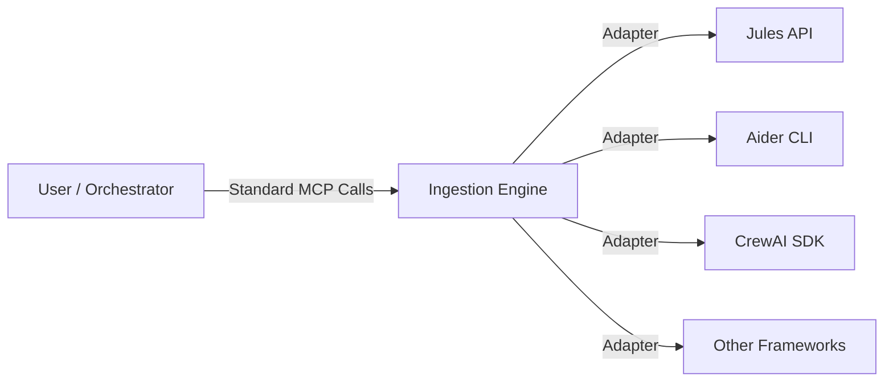
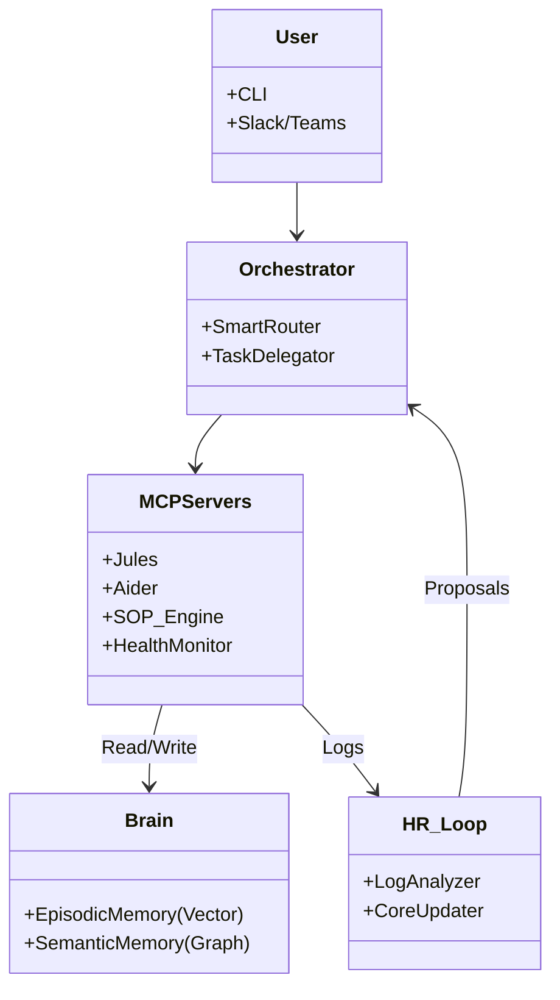

# 🏛️ Simple CLI Architecture

Simple CLI is built on the **6-Pillar Vision**, creating a robust, autonomous, and self-optimizing digital workforce.

## 1. Framework Ingestion Engine (The Universal Adapter)
This engine is the core capability that allows Simple CLI to absorb any AI framework.

## 2. Token-Efficient Memory (The Shared Brain)
All agents share a unified `.agent/brain/` memory system, drastically reducing token costs.

*   **Episodic Memory**: Vector Database (LanceDB) stores past experiences.
*   **Semantic Memory**: Graph Database stores relationships between concepts.
*   **Benefit**: Eliminates redundant context passing (70% savings).

## 3. "Company Context" Onboarding (The Briefcase)
Each company has a dedicated context stored in `.agent/config.json` and a private vector space. This ensures strict multi-tenant isolation.

*   **Internal Docs**: Uploaded and indexed.
*   **Brand Voice**: Configurable personas.
*   **Past Decisions**: Recalled during execution.

## 4. SOP-as-Code (The Operating Manual)
Workflows are defined in Markdown files (`docs/sops/*.md`) and executed deterministically by the `sop_engine` MCP server.

*   **Format**: Standard Markdown.
*   **Execution**: Step-by-step with LLM reasoning.
*   **Resilience**: Automatic retries and error handling.

## 5. "Ghost Mode" Persistence (The 24/7 Employee)
Background agents run autonomously via CRON jobs, performing tasks while you sleep.

*   **Mechanism**: Daemon process (`simple-daemon`).
*   **Tasks**: Morning Standups, Code Reviews, Security Scans.
*   **Integration**: Seamlessly updates the Brain and Context.

## 6. Recursive Self-Optimization (The "HR Loop")
The system reflects on its performance and proposes improvements to its own source code.

*   **Analysis**: Reviews execution logs (`sop_logs.json`).
*   **Proposal**: Suggests `propose_change` via HR MCP.
*   **Approval**: Requires human verification for safety.

---

## Technical Diagram

[View API Documentation](./api/index.html)
